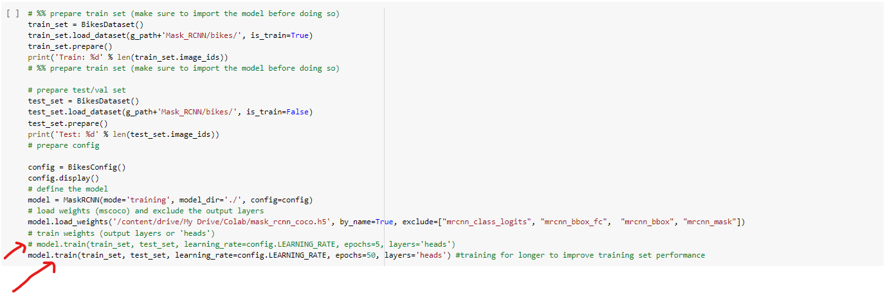
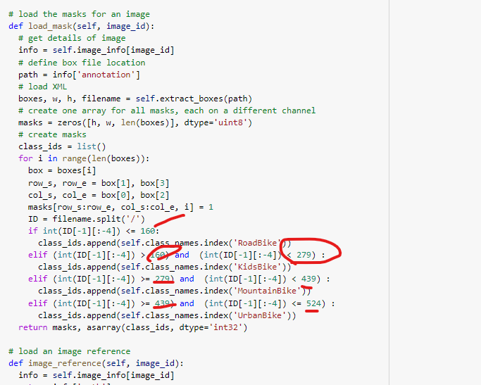

# How to Run the code (by Matt)

This implementation of Mask R-CNN was developed by our Austrian Startup to meet client requirements.
Below you'll find a guide on how to run the code from our Google Colaboratory. If you need the link please e-mail me at mattheusveloso2@hotmail.com. Otherwise just use the BikeRecognition.ipynb file in the root of this repository

## Step 0: Preparation
To prepare to run you need to make sure to be running on a GPU from colab, otherwise your code will take days to run (if not months).
Inside google's colab, click on runtime -> change runtime type -> GPU.


## Step 1 - Installation
The first step of running the code is to begin with the section "Step 1: Installing python libraries"
Our implementation uses Mask-RCNN, Tensorflow 1.15.0 and Keras 2.25.0. it will *NOT* work with Tensorflow 2.0 due to Mask-RCNN's functions.

Please run all the cells in sequence:
"!git clone https://github.com/Mattveloso/Mask_RCNN.git" creates a copy of this repository's content inside google colab

"from google.colab import drive
drive.mount('/content/drive')"
You will need to run this command and log in with your google drive credentials, please follow the instructions present in the cell. This is important because Github won't store our training file that we need to use to train the Neural Network. Please download it from:

https://github.com/matterport/Mask_RCNN/releases/download/v2.0/mask_rcnn_coco.h5

And place it in your Google drive in a folder called "Colab" (which has to be located at your gdrive's root). After it is uploade to your google drive and you've connected it to the Colaboratory, You will be able to train our AI.

All the other fields in step 1 just need to be run in order to make sure all packages are correctly installed


## Step 2 - preparing to run
Now, to make sure that the networks has its core code that it needs to run, please run the following cells in sequece and unchaged.

## Step 3 - quick training

An important field to be chosen is the amount of epochs that the Ai should be trained for. Leaving technical jargon aside, this is imporant to choose for how long your AI will be trained for. The longer usually the better (though too much training if done wrongly may lead to an overfit model, or a model that works well on training data but not in unseen data). Therefore I'd recommend choosing between the commented lines of either 5 (quick training) or 50 epochs (long training) to train your data. 

To train the neural network with the standard images of the project (obtained from Dectlhon.de's Fahrrad section) just run the code as-is. If you want to add more images please look at the next section on "how to train neural netowork". Make sure to comment out the unwanted line with the amount of epochs. (add/remove a # before the line to comment, commented code is ignored by the interpreter).


If you keep it like this, it will train the AI for around one hour. 5 epochs takes around 10 minutes and should be better for less technical demanding tests.

## Step 4 - Test
Now that you have trained your network, choose the most recent model trained and paste it on the code to be able to use it to predict.

That can be done by accesing the sidebar from google's colab a, like in the image below:

Find the folder with the configuration files, it should look very similar to the picture below. If it does not show up click on refresh. If it still is not showing up you probably haven't trained the neural Network correctly.

Open the folder, click on the last configuration with the right button (probably ends with a 5 or 50 from the amount of epochs you chose) and choose "Copy path". Paste this path in the right place in the testing cell (it says "add model here"):


 
Finnaly, run this cell and the cell below. It will test a preset number of images from one of the test sets (there are four, one for each bike type). You can switch that by choosing the interval for the bike numbers inside the "range" parameters.


## Bonus: Testing in unseen pictures
If you with to test on a user-uploaded picture, upload one to the colab by running the cell on the "Bonus" part. After uploading and running both cells it will use the AI to guess what kind you bike your uploaded.

Note that if nothing is displayed, the AI thinks that there is no bike in the picture.

# How to train Neural Network on Dataset (by Matt)

To train our implementation of this AI you will need Images with bikes and their labels. To do that I highly recommend that you use "Make Sense"

https://www.makesense.ai/

This allows you to input your images and label the correctly. Your images will need to be labeled as "MountainBikes, KidsBike, RoadBike or UrbanBike".

Simply:
- go to makesense's website;
- click on get started;
- upload your pictures (after naming them with numbers.jpg such as 1.jpg, 2.jpg, etc...) You can name them as you want but naming in this format will allow the code to run on an "as-is" basis. Make sure also to keep all roadbikes together (such as 1-10 are all roadbikes). The sequece has to be Roadbikes, Kidsbikes, Mountabikes and Urbanbikes to run as-is;
- Click on Object Detection
- Start project;
- COCO SSD -> use model;
- Reject any classes that Makesense suggest.
- Create your own class in the "update labels names part"
- Insert label name such as "MountainBike" and hit accept.


- Using your mouse, put a box around the bike
- click on select label, select your created label


- After doing this to every single bike in all pictures, click on export labels
- chose the opction ".zip package VOC XML"
- Save it and extract.
- Now, you have a file with the same name of the images you uploaded that the AI can understand to tell where the bike is and what kind of bike it is. 

upload these pictures to your google drive folder, on a folder called bikes/images. Upload the labels in a folder called bikes/annots.

### Changes in the code
Now that you have uploaded these pictures (and hopefully also connected your google drive, you'll need to make changes to the code to run it).

Well this could all also be done by using github, but this manual is for beginner users who might not have git expertise. Feel free to chose your upload method.

On the step 2 part, you need to change the following code:

"
#Directory of images to run detection on
IMAGE_DIR = g_path+'Mask_RCNN/bikes/images/'
"

and substitute for , IMAGE_DIR = g_path+'drive/My Drive/bikes/images/'

Now, in the training cell, also change the same paths to the ones in your drive

This code, specifically: 
"
train_set = BikesDataset()
train_set.load_dataset(g_path+'Mask_RCNN/bikes/', is_train=True)
train_set.prepare()
print('Train: %d' % len(train_set.image_ids))

test_set = BikesDataset()
test_set.load_dataset(g_path+'Mask_RCNN/bikes/', is_train=False)
test_set.prepare()
print('Test: %d' % len(test_set.image_ids))
"

Not only that but you will have to organize the training and testing numbers. The cell right under step 3 creates a list for all images in each category, you need to change this one to match your uploaded files. (change the numbers inside the range argument).

Also in the testing part changing the numbers inside the range function will be important, further info about this can be found under the "Step 4 - Test" of the "How to run the code" guide.

Lastly, you will need to change which images go into training and testing. This needs to happen in 2 parts of the code, they can be found below:




Finally, please read the commented code to understand what all these changes mean, or e-mail me.

Now, just run the training cell, if you made all the above changes correctly, it will train it. A training guide is also available on the "How to run the code" guide above.


--------------------------------------------------------------------------------------------------------------------
# Original Description Below: Mask R-CNN for Object Detection and Segmentation (By Original Authors of Mask-RCNN)

This is an implementation of [Mask R-CNN](https://arxiv.org/abs/1703.06870) on Python 3, Keras, and TensorFlow. The model generates bounding boxes and segmentation masks for each instance of an object in the image. It's based on Feature Pyramid Network (FPN) and a ResNet101 backbone.


The repository includes:
* Source code of Mask R-CNN built on FPN and ResNet101.
* Training code for MS COCO
* Pre-trained weights for MS COCO
* Jupyter notebooks to visualize the detection pipeline at every step
* ParallelModel class for multi-GPU training
* Evaluation on MS COCO metrics (AP)
* Example of training on your own dataset


The code is documented and designed to be easy to extend. If you use it in your research, please consider citing this repository (bibtex below). If you work on 3D vision, you might find our recently released [Matterport3D](https://matterport.com/blog/2017/09/20/announcing-matterport3d-research-dataset/) dataset useful as well.
This dataset was created from 3D-reconstructed spaces captured by our customers who agreed to make them publicly available for academic use. You can see more examples [here](https://matterport.com/gallery/).

# Getting Started
* [demo.ipynb](samples/demo.ipynb) Is the easiest way to start. It shows an example of using a model pre-trained on MS COCO to segment objects in your own images.
It includes code to run object detection and instance segmentation on arbitrary images.

* [train_shapes.ipynb](samples/shapes/train_shapes.ipynb) shows how to train Mask R-CNN on your own dataset. This notebook introduces a toy dataset (Shapes) to demonstrate training on a new dataset.

* ([model.py](mrcnn/model.py), [utils.py](mrcnn/utils.py), [config.py](mrcnn/config.py)): These files contain the main Mask RCNN implementation. 


* [inspect_data.ipynb](samples/coco/inspect_data.ipynb). This notebook visualizes the different pre-processing steps
to prepare the training data.

* [inspect_model.ipynb](samples/coco/inspect_model.ipynb) This notebook goes in depth into the steps performed to detect and segment objects. It provides visualizations of every step of the pipeline.

* [inspect_weights.ipynb](samples/coco/inspect_weights.ipynb)
This notebooks inspects the weights of a trained model and looks for anomalies and odd patterns.


# Step by Step Detection
To help with debugging and understanding the model, there are 3 notebooks 
([inspect_data.ipynb](samples/coco/inspect_data.ipynb), [inspect_model.ipynb](samples/coco/inspect_model.ipynb),
[inspect_weights.ipynb](samples/coco/inspect_weights.ipynb)) that provide a lot of visualizations and allow running the model step by step to inspect the output at each point. Here are a few examples:


## 1. Anchor sorting and filtering
Visualizes every step of the first stage Region Proposal Network and displays positive and negative anchors along with anchor box refinement.


## 2. Bounding Box Refinement
This is an example of final detection boxes (dotted lines) and the refinement applied to them (solid lines) in the second stage.


## 3. Mask Generation
Examples of generated masks. These then get scaled and placed on the image in the right location.


## 4.Layer activations
Often it's useful to inspect the activations at different layers to look for signs of trouble (all zeros or random noise).


## 5. Weight Histograms
Another useful debugging tool is to inspect the weight histograms. These are included in the inspect_weights.ipynb notebook.


## 6. Logging to TensorBoard
TensorBoard is another great debugging and visualization tool. The model is configured to log losses and save weights at the end of every epoch.


## 6. Composing the different pieces into a final result


# Training on MS COCO
We're providing pre-trained weights for MS COCO to make it easier to start. You can
use those weights as a starting point to train your own variation on the network.
Training and evaluation code is in `samples/coco/coco.py`. You can import this
module in Jupyter notebook (see the provided notebooks for examples) or you
can run it directly from the command line as such:

```
# Train a new model starting from pre-trained COCO weights
python3 samples/coco/coco.py train --dataset=/path/to/coco/ --model=coco

# Train a new model starting from ImageNet weights
python3 samples/coco/coco.py train --dataset=/path/to/coco/ --model=imagenet

# Continue training a model that you had trained earlier
python3 samples/coco/coco.py train --dataset=/path/to/coco/ --model=/path/to/weights.h5

# Continue training the last model you trained. This will find
# the last trained weights in the model directory.
python3 samples/coco/coco.py train --dataset=/path/to/coco/ --model=last
```

You can also run the COCO evaluation code with:
```
# Run COCO evaluation on the last trained model
python3 samples/coco/coco.py evaluate --dataset=/path/to/coco/ --model=last
```

The training schedule, learning rate, and other parameters should be set in `samples/coco/coco.py`.


# Training on Your Own Dataset

Start by reading this [blog post about the balloon color splash sample](https://engineering.matterport.com/splash-of-color-instance-segmentation-with-mask-r-cnn-and-tensorflow-7c761e238b46). It covers the process starting from annotating images to training to using the results in a sample application.

In summary, to train the model on your own dataset you'll need to extend two classes:

```Config```
This class contains the default configuration. Subclass it and modify the attributes you need to change.

```Dataset```
This class provides a consistent way to work with any dataset. 
It allows you to use new datasets for training without having to change 
the code of the model. It also supports loading multiple datasets at the
same time, which is useful if the objects you want to detect are not 
all available in one dataset. 

See examples in `samples/shapes/train_shapes.ipynb`, `samples/coco/coco.py`, `samples/balloon/balloon.py`, and `samples/nucleus/nucleus.py`.

## Differences from the Official Paper
This implementation follows the Mask RCNN paper for the most part, but there are a few cases where we deviated in favor of code simplicity and generalization. These are some of the differences we're aware of. If you encounter other differences, please do let us know.

* **Image Resizing:** To support training multiple images per batch we resize all images to the same size. For example, 1024x1024px on MS COCO. We preserve the aspect ratio, so if an image is not square we pad it with zeros. In the paper the resizing is done such that the smallest side is 800px and the largest is trimmed at 1000px.
* **Bounding Boxes**: Some datasets provide bounding boxes and some provide masks only. To support training on multiple datasets we opted to ignore the bounding boxes that come with the dataset and generate them on the fly instead. We pick the smallest box that encapsulates all the pixels of the mask as the bounding box. This simplifies the implementation and also makes it easy to apply image augmentations that would otherwise be harder to apply to bounding boxes, such as image rotation.

    To validate this approach, we compared our computed bounding boxes to those provided by the COCO dataset.
We found that ~2% of bounding boxes differed by 1px or more, ~0.05% differed by 5px or more, 
and only 0.01% differed by 10px or more.

* **Learning Rate:** The paper uses a learning rate of 0.02, but we found that to be
too high, and often causes the weights to explode, especially when using a small batch
size. It might be related to differences between how Caffe and TensorFlow compute 
gradients (sum vs mean across batches and GPUs). Or, maybe the official model uses gradient
clipping to avoid this issue. We do use gradient clipping, but don't set it too aggressively.
We found that smaller learning rates converge faster anyway so we go with that.

## Citation
Use this bibtex to cite this repository:
```
@misc{matterport_maskrcnn_2017,
  title={Mask R-CNN for object detection and instance segmentation on Keras and TensorFlow},
  author={Waleed Abdulla},
  year={2017},
  publisher={Github},
  journal={GitHub repository},
  howpublished={\url{https://github.com/matterport/Mask_RCNN}},
}
```

## Contributing
Contributions to this repository are welcome. Examples of things you can contribute:
* Speed Improvements. Like re-writing some Python code in TensorFlow or Cython.
* Training on other datasets.
* Accuracy Improvements.
* Visualizations and examples.

You can also [join our team](https://matterport.com/careers/) and help us build even more projects like this one.

## Requirements
Python 3.4, TensorFlow 1.3, Keras 2.0.8 and other common packages listed in `requirements.txt`.

### MS COCO Requirements:
To train or test on MS COCO, you'll also need:
* pycocotools (installation instructions below)
* [MS COCO Dataset](http://cocodataset.org/#home)
* Download the 5K [minival](https://dl.dropboxusercontent.com/s/o43o90bna78omob/instances_minival2014.json.zip?dl=0)
  and the 35K [validation-minus-minival](https://dl.dropboxusercontent.com/s/s3tw5zcg7395368/instances_valminusminival2014.json.zip?dl=0)
  subsets. More details in the original [Faster R-CNN implementation](https://github.com/rbgirshick/py-faster-rcnn/blob/master/data/README.md).

If you use Docker, the code has been verified to work on
[this Docker container](https://hub.docker.com/r/waleedka/modern-deep-learning/).


## Installation
1. Clone this repository
2. Install dependencies
   ```bash
   pip3 install -r requirements.txt
   ```
3. Run setup from the repository root directory
    ```bash
    python3 setup.py install
    ``` 
3. Download pre-trained COCO weights (mask_rcnn_coco.h5) from the [releases page](https://github.com/matterport/Mask_RCNN/releases).
4. (Optional) To train or test on MS COCO install `pycocotools` from one of these repos. They are forks of the original pycocotools with fixes for Python3 and Windows (the official repo doesn't seem to be active anymore).

    * Linux: https://github.com/waleedka/coco
    * Windows: https://github.com/philferriere/cocoapi.
    You must have the Visual C++ 2015 build tools on your path (see the repo for additional details)

# Projects Using this Model
If you extend this model to other datasets or build projects that use it, we'd love to hear from you.

### [4K Video Demo](https://www.youtube.com/watch?v=OOT3UIXZztE) by Karol Majek.
[](https://www.youtube.com/watch?v=OOT3UIXZztE)

### [Images to OSM](https://github.com/jremillard/images-to-osm): Improve OpenStreetMap by adding baseball, soccer, tennis, football, and basketball fields.


### [Splash of Color](https://engineering.matterport.com/splash-of-color-instance-segmentation-with-mask-r-cnn-and-tensorflow-7c761e238b46). A blog post explaining how to train this model from scratch and use it to implement a color splash effect.


### [Segmenting Nuclei in Microscopy Images](samples/nucleus). Built for the [2018 Data Science Bowl](https://www.kaggle.com/c/data-science-bowl-2018)
Code is in the `samples/nucleus` directory.


### [Detection and Segmentation for Surgery Robots](https://github.com/SUYEgit/Surgery-Robot-Detection-Segmentation) by the NUS Control & Mechatronics Lab.


### [Reconstructing 3D buildings from aerial LiDAR](https://medium.com/geoai/reconstructing-3d-buildings-from-aerial-lidar-with-ai-details-6a81cb3079c0)
A proof of concept project by [Esri](https://www.esri.com/), in collaboration with Nvidia and Miami-Dade County. Along with a great write up and code by Dmitry Kudinov, Daniel Hedges, and Omar Maher.


### [Usiigaci: Label-free Cell Tracking in Phase Contrast Microscopy](https://github.com/oist/usiigaci)
A project from Japan to automatically track cells in a microfluidics platform. Paper is pending, but the source code is released.

 

### [Characterization of Arctic Ice-Wedge Polygons in Very High Spatial Resolution Aerial Imagery](http://www.mdpi.com/2072-4292/10/9/1487)
Research project to understand the complex processes between degradations in the Arctic and climate change. By Weixing Zhang, Chandi Witharana, Anna Liljedahl, and Mikhail Kanevskiy.


### [Mask-RCNN Shiny](https://github.com/huuuuusy/Mask-RCNN-Shiny)
A computer vision class project by HU Shiyu to apply the color pop effect on people with beautiful results.


### [Mapping Challenge](https://github.com/crowdAI/crowdai-mapping-challenge-mask-rcnn): Convert satellite imagery to maps for use by humanitarian organisations.


### [GRASS GIS Addon](https://github.com/ctu-geoforall-lab/i.ann.maskrcnn) to generate vector masks from geospatial imagery. Based on a [Master's thesis](https://github.com/ctu-geoforall-lab-projects/dp-pesek-2018) by Ondřej Pešek.

